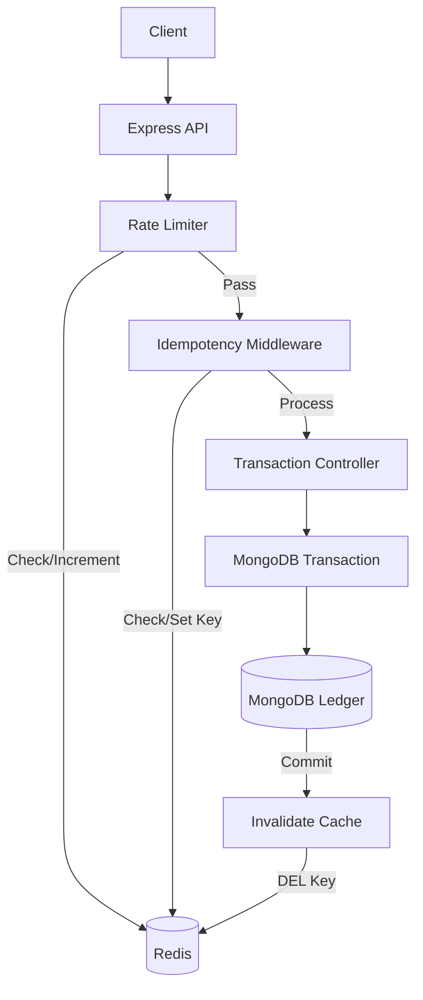

# Redis Architecture in Ledger-Based Banking System

## Overview
This document explains the integration of Redis into the Ledger-Based Banking System (Phase 2), outlining how it provides caching, idempotency, and rate-limiting capabilities while maintaining the existing MongoDB ledger as the source of truth.

## Why Redis is Used

### 1. Caching
Redis is used to temporarily store frequently accessed, non-critical data.
- **Endpoint**: `GET /api/accounts/getSummary` (Dashboard)
- **Benefit**: Reduces repeated database reads, lowering latency and DB load.
- **Source of Truth**: MongoDB remains the definitive source of truth for all account balances and ledger entries. We do **not** trust Redis for financial correctness.
- **Invalidation**: The cache is invalidated automatically upon successful financial transactions to ensure data consistency.

### 2. Idempotency
Redis provides fast, atomic temporary storage (`SET NX`) for idempotency keys to prevent duplicate financial operations.
- **Endpoint**: `POST /api/transactions/` (Transfers)
- **Mechanism**: When a transfer request arrives with an `Idempotency-Key`, we check Redis. If a "PROCESSING" state exists, we reject duplicates. If "COMPLETED", we return the cached successful response.

### 3. Rate Limiting
Redis stores counters and state required to enforce API limits consistently across multiple instances of the backend.
- **Benefits**: Protects against brute-force attacks and abuse (e.g., login, forgot password, general API).

## Architecture Diagram

## Failure Scenarios (Error Handling)
- **Rate Limiting & Caching**: **Fail Open**. If Redis is unavailable, rate limiters will allow requests to pass, and caching will bypass directly to MongoDB. The banking app remains usable.
- **Idempotency**: **Fail Closed**. Since idempotency protects financial writes, if Redis is down, we cannot guarantee safety. The system will return an HTTP 503 Service Unavailable, prioritizing consistency over availability.
