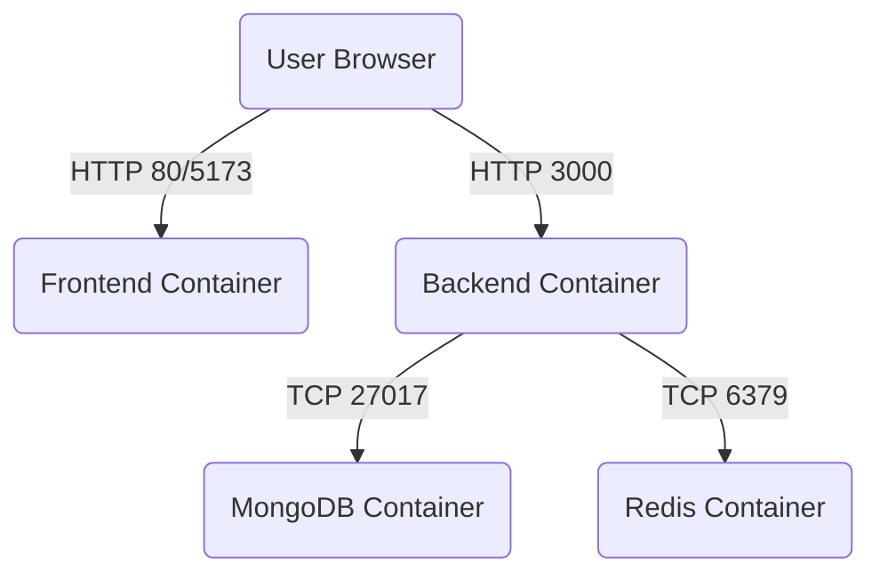

# LedgerPay Docker & Production Configuration

This document outlines the Docker containerization strategy for LedgerPay, providing a comprehensive guide to running the application in a multi-container environment via Docker Compose.

## 1. Docker Architecture

The application is split into four primary services that run isolated inside containers and communicate over a dedicated Docker network.

- **frontend**: React (Vite) Single Page Application served by a lightweight Nginx web server.
- **backend**: Node.js/Express API server.
- **mongodb**: Official MongoDB database for persistent data storage.
- **redis**: Official Redis server for caching and rate limiting.

### Service Interactions

*(Note: The browser accesses both the frontend and backend directly from the host machine).*

## 2. Ports and Network

### Network Configuration
All containers are attached to a custom bridge network named `ledgerpay-network`. Inside this network, services can discover and communicate with each other using their service names (e.g., `mongodb`, `redis`).

### Exposed Ports
- **Frontend**: Exposes port `5173` mapped to Nginx's port `80`.
- **Backend**: Exposes port `3000` mapped to Node.js's port `3000`.
- **MongoDB**: Exposes port `27017` mapped to MongoDB's port `27017`.
- **Redis**: Exposes port `6379` mapped to Redis's port `6379`.

## 3. Volumes

To ensure data persistence, the following named Docker volumes are created. These volumes survive container restarts and removal unless explicitly deleted.

- `mongodb_data`: Stores MongoDB database files (`/data/db`).
- `redis_data`: Stores Redis persistent data (`/data`).

## 4. Environment Variables

The backend application requires various environment variables for execution. The strategy utilizes environment specific files:

- `.env.example`: A template containing placeholders and default variables.
- `docker-compose.yml`: Defines specific environment variables to override `.env` defaults when running in Docker.

### Localhost vs. Docker Service Names

When running **locally** without Docker, the backend connects to infrastructure on the host machine:
- `MONGO_URI=mongodb://localhost:27017/ledgerpay`
- `REDIS_URL=redis://localhost:6379`

When running **inside Docker Compose**, `localhost` points to the container itself. Therefore, the backend must use Docker's service discovery names:
- `MONGO_URI=mongodb://mongodb:27017/ledgerpay`
- `REDIS_URL=redis://redis:6379`

> [!NOTE]
> The browser runs on the user's host machine. Therefore, when the frontend makes API calls, it still targets `http://localhost:3000/api`. This is handled dynamically via Vite build arguments in `docker-compose.yml`.

## 5. Development Setup

To run the full development environment with Docker:

1. Create a `.env` file in the `Backend` directory (copy from `.env.example` and add real secrets).
2. Ensure you do not have any conflicting local Redis or MongoDB instances running on ports `6379` or `27017`. Stop the existing `ledgerpay-redis` container if it's running.
3. Build the Docker images:
   ```bash
   docker compose build
   ```
4. Start the services:
   ```bash
   docker compose up -d
   ```
5. View logs:
   ```bash
   docker compose logs -f
   ```

## 6. Testing Setup

To run automated tests against the database without destroying development data:
- Use a dedicated test database (e.g., `mongodb://localhost:27017/ledgerpay_test`) by specifying `NODE_ENV=test` and adjusting the `MONGO_URI` in `.env.test`.

## 7. Production Setup

For a true production deployment:
1. Do **NOT** expose MongoDB (`27017:27017`) and Redis (`6379:6379`) ports in `docker-compose.yml`. Only the backend needs access.
2. Set `NODE_ENV=production`.
3. Provide secure and strong secrets for `JWT_ACCESS_SECRET` and `JWT_REFRESH_SECRET`.
4. Ensure `CLIENT_URL` correctly matches the production frontend domain (for CORS).

## 8. Troubleshooting

### Port Conflicts
If you encounter a `Bind for 0.0.0.0:6379 failed: port is already allocated` error, you likely have the old `ledgerpay-redis` container running.
**Fix**: `docker stop ledgerpay-redis`

### Deleting Persistent Data
If you need to wipe your database and Redis cache entirely and start fresh:
```bash
docker compose down -v
```
> [!CAUTION]
> The `-v` flag permanently deletes all data within the `mongodb_data` and `redis_data` volumes.

### Checking Service Status
```bash
docker compose ps
```
Ensure all services report as `healthy` or `running`.
